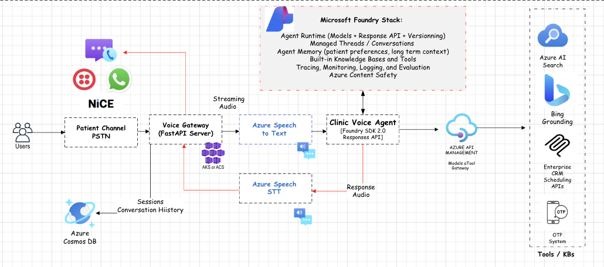

# Clinic Voice Agent

AI-powered voice scheduling assistant for hospital call centers, built on **Microsoft Azure**.

> **The Problem:** Hospital call centers handle thousands of routine scheduling calls daily—booking, rescheduling, and cancellations. Staff spend significant time on repetitive tasks while patients wait on hold. This solution automates ~80% of scheduling interactions, reducing wait times and freeing agents for complex cases.

## How It Works

1. **Patient calls** the hospital scheduling line via PSTN
2. **Telephony platform** (CCaaS/PBX) routes audio to the Voice Gateway API
3. **Azure Speech** converts speech to text in real-time
4. **Foundry Agent** processes the request—verifies identity via OTP, searches for doctors, checks availability
5. **Agent executes tools** to book/reschedule/cancel appointments, then confirms via SMS
6. **Azure Speech** converts the response back to audio
7. **Complex requests** seamlessly transfer to human agents with full context

The agent maintains conversation state across turns, remembers patient preferences, and answers policy questions using RAG with citations.

## Architecture



## Tech Stack

| Layer | Component | Technology | Purpose |
|-------|-----------|------------|---------|
| **Foundry Agent Service** | Agent SDK | `azure-ai-projects` | Create and run Foundry agents via Responses API |
| | LLM | `gpt-4o-mini` | Conversation understanding and response generation |
| | Managed Threads | Foundry Threads | Stateful multi-turn conversation management |
| **Knowledge & Tools** | Web Search | WebSearchPreviewTool | Answer general questions (visiting hours, directions) |
| | RAG | Azure AI Search | Policy and FAQ retrieval with citations |
| | Function Tools | 14 custom tools | Identity, scheduling, handoff, SMS confirmation |
| **Foundry Memory** | Memory Store | MemorySearchTool | Store and retrieve long-term patient preferences |
| **Foundry Observability** | Tracing | Azure Monitor | Request tracing and performance monitoring |
| | Logging | App Insights | Agent execution logs and diagnostics |
| **Application Layer** | API Server | FastAPI + Uvicorn | HTTP endpoints for chat and health |
| | Sessions | Azure Cosmos DB | Persist conversation history (24h TTL) |
| | Interfaces | Web UI + CLI | Development and testing interfaces |
| **Voice Integration** | Speech-to-Text | Azure Speech STT | Convert caller audio to text |
| | Text-to-Speech | Azure Speech TTS | Convert agent response to audio |
| | Telephony | CCaaS + Voice Gateway | PSTN connectivity and audio routing |

## Prerequisites

- Python 3.11+
- Azure subscription with:
  - Azure AI Foundry project (with gpt-4o-mini deployed)
  - Azure Cosmos DB (optional - falls back to in-memory sessions)
- Azure CLI (`az login` authenticated)

## Quick Start

### 1. Clone and Install

```bash
git clone https://github.com/hamza-roujdami/clinic-voice-agent
cd clinic-voice-agent

python -m venv .venv && source .venv/bin/activate
pip install -r requirements.txt
```

### 2. Configure Environment

```bash
cp .env.example .env
```

Edit `.env` with your Azure credentials:

```bash
# Required - Azure AI Foundry
PROJECT_ENDPOINT=https://your-resource.services.ai.azure.com/api/projects/your-project
FOUNDRY_MODEL_PRIMARY=gpt-4o-mini

# Optional - Session persistence (falls back to in-memory)
COSMOS_ENDPOINT=https://your-cosmos.documents.azure.com:443/
COSMOS_DATABASE=clinic-voice-agent
COSMOS_CONTAINER=sessions
```

### 3. (Optional) Deploy Infrastructure

If you need to create Azure resources:

```bash
cd infra/public
./deploy.sh rg-clinic-voice-agent swedencentral
cd ../..
```

### 4. (Optional) Setup Foundry Memory

For patient preference memory across sessions:

```bash
python scripts/setup_memory_store.py
```

### 5. Run the Server

```bash
python main.py
```

Server starts at http://localhost:8000

## Testing

### Web UI
Open http://localhost:8000 in your browser

### CLI Mode
```bash
python cli.py
```

### API (curl)
```bash
# Start a conversation
curl -X POST http://localhost:8000/chat \
  -H "Content-Type: application/json" \
  -d '{"message": "Hello"}'

# Continue with session_id from response
curl -X POST http://localhost:8000/chat \
  -H "Content-Type: application/json" \
  -d '{"message": "I need to see a cardiologist", "session_id": "<session_id>"}'
```

---

## Full Booking Flow (Demo)

Test the complete appointment booking experience. Uses mock data - no real appointments created.

**Demo Patient:** MRN-5050 (Hamza El-Ghoujdami)  
**OTP Code:** 123456 (mock - always works)

```
User: Hello
Bot:  Hello, I can help you book, change, or cancel an appointment. 
      What would you like to do?

User: I need to see a cardiologist next week
Bot:  Sure! Is this for you or someone else?

User: For me
Bot:  Got it! Which day works best for you next week?

User: Tuesday would be great
Bot:  I found two cardiologists at Heart Center on Floor 3:
      1. Dr. Sarah Al-Mansoori
      2. Dr. Yousef Qasim
      Would you prefer to see Dr. Al-Mansoori or Dr. Qasim?

User: Dr. Al-Mansoori please
Bot:  I found several slots for Dr. Al-Mansoori on Tuesday:
      1. 9:00 AM
      2. 10:00 AM
      3. 2:00 PM
      Which time would work best for you?

User: Tuesday afternoon
Bot:  The next available slot in the afternoon is at 2:00 PM. 
      Should I book that for you?

User: Yes please
Bot:  I'll need to verify your identity before booking. 
      Could you please provide your MRN or phone number?

User: My MRN is MRN-5050
Bot:  Thanks Hamza. I've sent a 6-digit code to your phone ending in 2805. 
      Please tell me the code when you receive it.

User: The code is 123456
Bot:  Done — your appointment is booked for Tuesday, February 14 at 2:00 PM 
      with Dr. Sarah Al-Mansoori at Heart Center, Floor 3.
      Would you like a text confirmation?

User: Yes
Bot:  Sent. Anything else I can help with?

User: No that's all
Bot:  You're welcome! Have a great day!
```

### Other Test Scenarios

| Scenario | What to Say | Expected |
|----------|-------------|----------|
| Cancel appointment | "I want to cancel my appointment" | Asks which one, then verifies identity |
| Reschedule | "I need to reschedule" | Asks for new date/time |
| Human handoff | "Let me speak to a real person" | Initiates transfer with wait time |
| Frustrated user | "This is frustrating, get me someone" | Escalates to human agent |
| General question | "What are the visiting hours?" | Uses Bing search (no verification needed) |

## Project Structure

```
clinic-voice-agent/
├── agents/              # Foundry agent factory and prompts
│   ├── factory.py       # AgentFactory (creates/runs agent)
│   ├── prompts.py       # System prompt and examples
│   └── memory.py        # Foundry Memory helpers
├── api/                 # FastAPI routes
│   └── routes.py        # /chat, /session, /health endpoints
├── tools/               # Agent function tools
│   ├── otp.py           # Patient lookup, OTP verification
│   ├── scheduling.py    # Appointments, doctors, slots, SMS
│   ├── handoff.py       # Human transfer
│   ├── context.py       # Patient context injection
│   └── decorator.py     # Tool registration decorator
├── sessions/            # Session management
│   ├── manager.py       # SessionManager singleton
│   └── cosmos_store.py  # Cosmos DB persistence
├── scripts/             # Setup and utility scripts
│   └── setup_memory_store.py  # Create Foundry Memory Store
├── tests/               # Integration tests
├── static/              # Web UI (index.html)
├── infra/               # Bicep IaC templates
├── config.py            # Environment configuration
├── main.py              # FastAPI server
├── cli.py               # CLI interface
└── requirements.txt
```


### Data Flow

```
User Message → POST /chat → Session Lookup (Cosmos DB)
                               ↓
                    AgentFactory.run() → Foundry Responses API
                               ↓
                    Tool Execution (if needed) → tools/*.py
                               ↓
                    Session Update → Response to User
```

### Voice Integration

```
PSTN → CCaaS → Voice Gateway → Azure STT → Agent → Azure TTS → Audio Response
                    ↑
         (Audio stays in telephony platform - no raw audio in Azure)
```

---

## Sources & References

### Azure AI Foundry Documentation
- [Azure AI Foundry SDK (azure-ai-projects)](https://learn.microsoft.com/en-us/azure/ai-services/agents/quickstart) - Agent creation and Responses API
- [Foundry Agents How-To](https://learn.microsoft.com/en-us/azure/ai-foundry/agents/how-to/) - Tool binding, memory, web search

### SDK Samples (azure-sdk-for-python)
- [agents_basics.py](https://github.com/Azure/azure-sdk-for-python/blob/main/sdk/ai/azure-ai-projects/samples/agents/agents_basics.py) - Basic agent creation
- [agents_with_resources_in_thread.py](https://github.com/Azure/azure-sdk-for-python/blob/main/sdk/ai/azure-ai-projects/samples/agents/agents_with_resources_in_thread.py) - File and search resources
- [sample_agent_web_search.py](https://github.com/Azure/azure-sdk-for-python/blob/main/sdk/ai/azure-ai-projects/samples/agents/tools/sample_agent_web_search.py) - Web search tool

### Responses API (v2 Pattern)
- [sample_agents_responses_stream.py](https://github.com/Azure/azure-sdk-for-python/blob/main/sdk/ai/azure-ai-projects/samples/agents/sample_agents_responses_stream.py) - Streaming responses
- [sample_agents_responses.py](https://github.com/Azure/azure-sdk-for-python/blob/main/sdk/ai/azure-ai-projects/samples/agents/sample_agents_responses.py) - Responses API
- [sample_agents_responses_local_function_tools.py](https://github.com/Azure/azure-sdk-for-python/blob/main/sdk/ai/azure-ai-projects/samples/agents/sample_agents_responses_local_function_tools.py) - Function tool execution

### Azure Services
- [Azure Cosmos DB Python SDK](https://learn.microsoft.com/en-us/azure/cosmos-db/nosql/sdk-python) - Session storage
- [Azure Speech SDK](https://learn.microsoft.com/en-us/azure/ai-services/speech-service/get-started-speech-to-text) - STT/TTS (Phase 2)
- [Azure AI Search](https://learn.microsoft.com/en-us/azure/search/) - RAG retrieval (Planned)

### Python Libraries
- [FastAPI](https://fastapi.tiangolo.com/) - Web framework
- [Pydantic](https://docs.pydantic.dev/) - Data validation
- [Rich](https://rich.readthedocs.io/) - CLI formatting


---

## License

Demo/PoC purposes only. Not for production healthcare use without proper compliance review.
